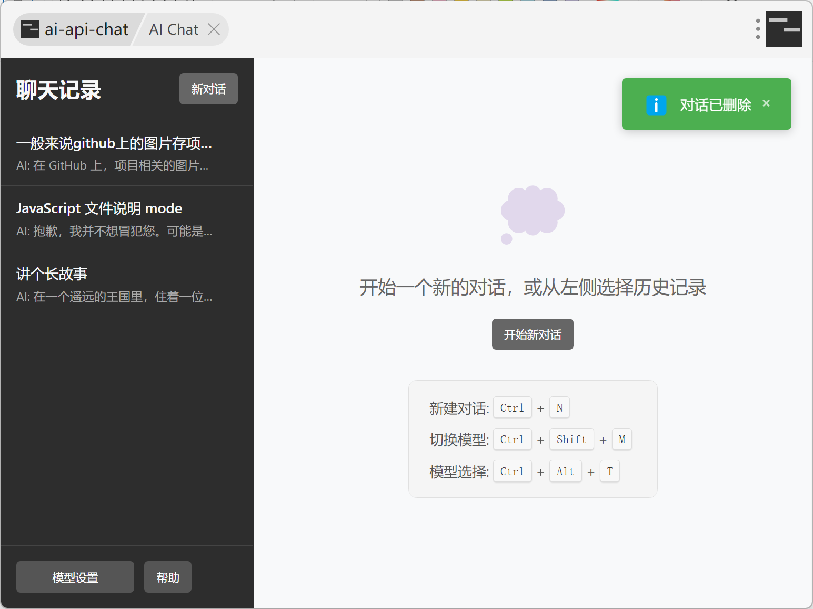
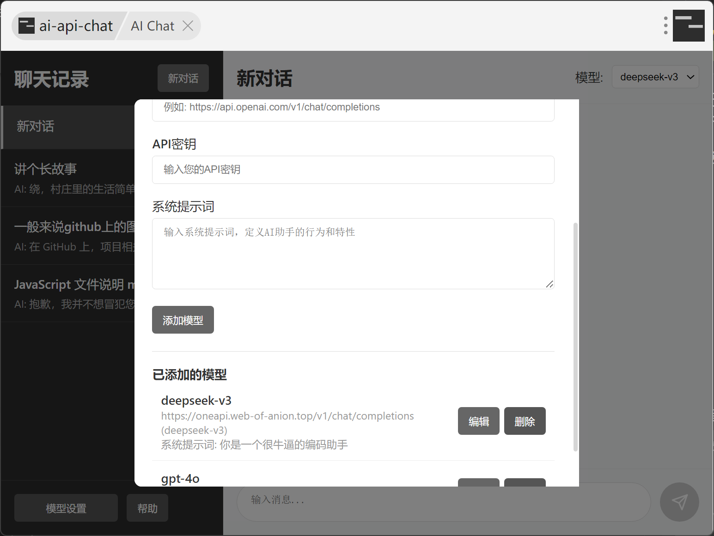
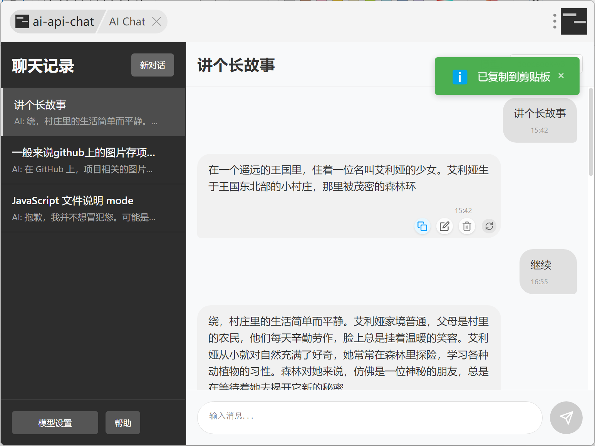

# uTools AI 聊天助手

一款 uTools AI 聊天插件，提供高度可定制的人工智能聊天体验。让你随时随地与 AI 模型对话，无需频繁切换应用。目标是复刻和改进utools官方ai聊天插件的简约utools AI聊天插件，支持添加多个API服务商模型，支持快速更换模型，历史对话，系统提示词设定

## 为什么开发这个插件？

uTools ai在旧版utools已经无法使用， 更新的utools中限制了免费插件数量并且该插件需要收费；现有开源的 AI 聊天插件似乎难以同时支持添加大量自定义模型配置和保存完整的聊天历史记录。

## 核心功能

### 快捷键
- `Ctrl + N`: 新建对话
- `Ctrl + Shift + M`: 切换到下一个模型
- `Ctrl + Alt + T`: 打开模型选择器，输入前缀直接回车选择
- `Enter`: 发送消息
- `Shift + Enter`: 换行

### 模型管理

- 支持添加多个不同的 AI 模型配置
- 兼容所有 OpenAI API 格式的模型服务
- 快捷键快速切换不同模型，满足不同场景需求
- 系统提示词自定义

### 聊天历史记录管理

- 本地保存所有聊天记录
- 随时继续之前的对话
- 支持编辑已发送的消息并重新生成回复
- 按照最新编辑时间排序

### 流式响应与 Markdown 支持

- AI 回复实时流式显示，提升体验
- 完整支持 Markdown 格式渲染

### 快捷功能（开发中）
- 选中任意文本，快速调用 AI 翻译
- 选中代码或专业术语，一键获取 AI 解释
- 结果自动复制到剪贴板，方便使用

## 安装方法

1. 安装 uTools 开发者插件
2. 新建项目，选择本项目中的 plugin.json
3. 打开插件即可开始使用

## 使用技巧

- 使用 Ctrl+Enter 快速发送消息
- 鼠标悬停在消息上，点击编辑按钮修改已发送的消息

## 待开发功能

- [x] 多模型支持
- [x] 系统提示词设定
- [x] 历史记录本地存储
- [x] 流式响应
- [x] Markdown 渲染
- [ ] 历史聊天记录文字快捷搜索
- [ ] 更好的消息显示效果

## 技术说明
使用cursor+少量人工快速搓成，cursorrule文件也一并上传，如有cursor可以快速二次定制（改bug

如果你有任何建议或遇到问题，欢迎在 GitHub 上提出 Issue。祝你使用愉快！

