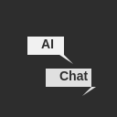
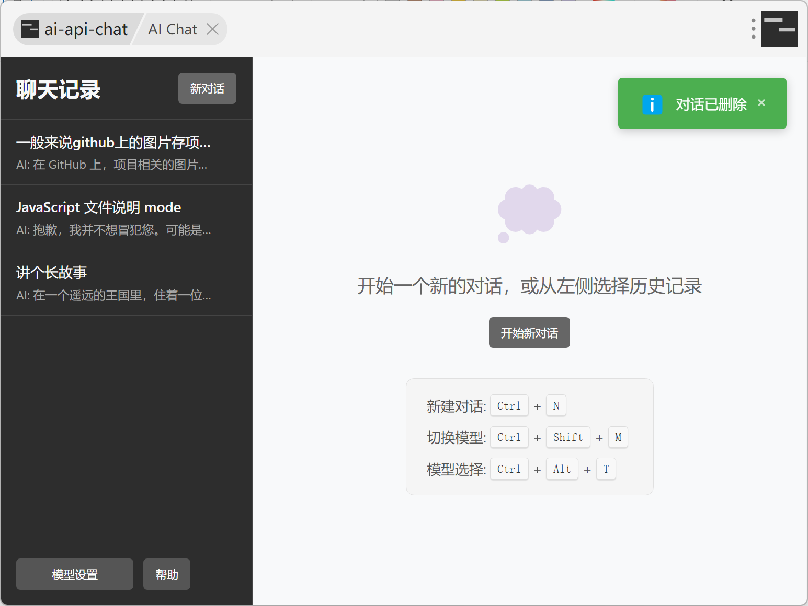
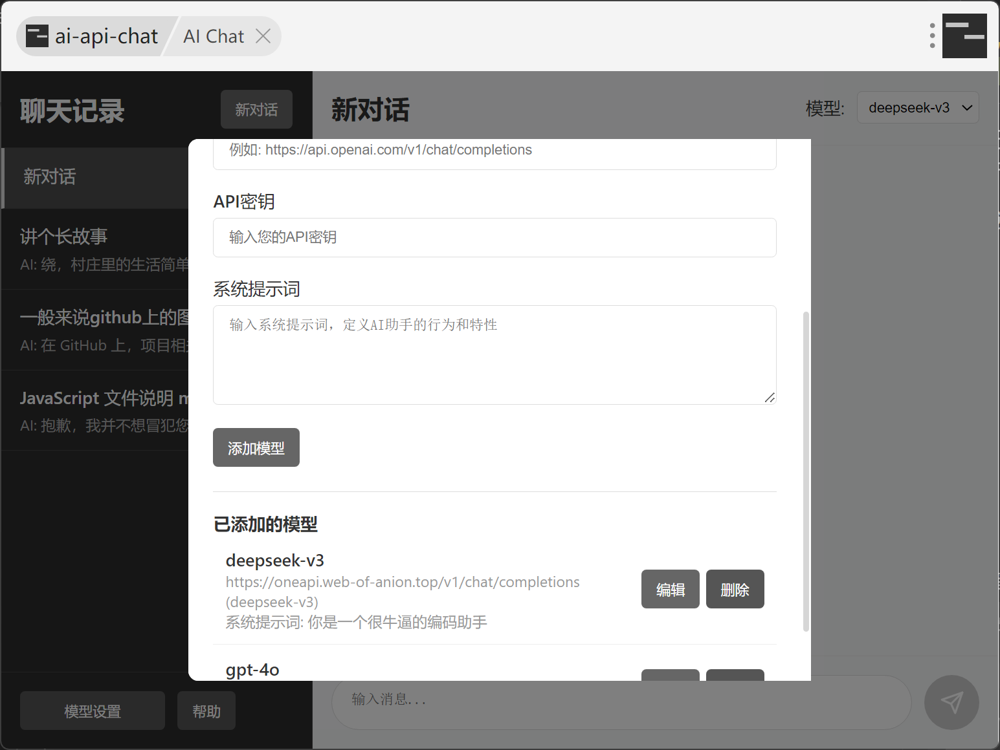
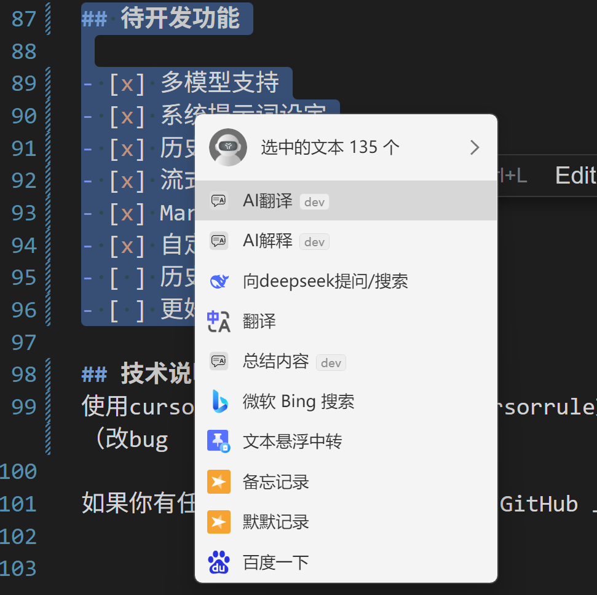

# Simple uTools AI Chat
> 若该项目对你有用，欢迎 star & fork🌟！


<p align="center">
    
</p>


一款专注于聊天功能的较简约的uTools AI 聊天插件，目标是复刻和改进utools官方ai聊天插件的简约utools AI聊天插件，支持添加多个API服务商模型，支持快速更换模型，历史对话，系统提示词设定

## 为什么开发这个插件？

uTools ai在旧版utools已经无法使用， 更新的utools中限制了免费插件数量并且该插件需要收费；现有开源的 AI 聊天插件似乎难以同时支持添加大量自定义模型配置和保存完整的聊天历史记录。


## 核心功能
<p align="center">
    
</p>

### 快捷键
- `Ctrl + N`: 新建对话
- `Ctrl + Shift + M`: 切换到下一个模型
- `Ctrl + Alt + T`: 打开模型选择器，输入前缀直接回车选择
- `Enter`: 发送消息
- `Shift + Enter`: 换行

### 模型管理
<p align="center">
    
</p>

- 支持添加多个不同的 AI 模型配置
- 兼容所有 OpenAI API 格式的模型服务
- 快捷键快速切换不同模型，满足不同场景需求
- 系统提示词自定义

### 聊天历史记录管理
<p align="center">
    
</p>

- 本地保存所有聊天记录
- 随时继续之前的对话
- 支持编辑已发送的消息并重新生成回复
- 按照最新编辑时间排序

### 流式响应与 Markdown 支持

- AI 回复实时流式显示，提升体验
- 完整支持 Markdown 格式渲染

### 快捷功能（开发中）
- 选中任意文本，快速调用 AI 翻译
- 选中代码或专业术语，一键获取 AI 解释
- 结果自动复制到剪贴板，方便使用

## 自定义指令功能

本插件提供了自定义指令功能，允许用户配置自己的AI快捷指令，提升文本处理效率。

### 预置指令和自定义快捷指令
可以在utools呼出栏输入使用或者在选择文本后在超级面板使用快捷指令。
<p align="center">
    
</p>

预制指令：
1. **AI翻译**：自动识别文本语言，中文翻译为英文，其他语言翻译为中文
<p align="center">
    
</p>
3. **AI解释**：解释所选文本内容，提供通俗易懂的说明


可以添加自己的指令，比如润色文段，扩写文段等等。
可以通过以下步骤创建自己的指令：


1. 点击界面左下角的"设置"按钮
2. 切换到"指令设置"标签页
3. 填写指令信息：
   - 指令名称：显示在uTools中的名称
   - 指令代码：唯一标识符，不可重复
   - 指令描述：简短说明该指令的用途
   - 系统提示词：AI执行指令时的角色定义和任务说明
4. 点击"添加指令"按钮保存


## 项目结构

```
utools-ai-chat/
├── vue-app/              # 源代码目录
│   ├── src/              # Vue 源代码
│   └── public/           # 静态资源（plugin.json, preload.js, logo.png）
├── screenshots/          # 项目截图
└── README.md             # 文档

# 构建后生成（已加入 .gitignore）
├── assets/               # 构建后的 JS/CSS
├── index.html            # 入口文件
├── plugin.json           # 插件配置
├── preload.js            # preload 脚本
└── logo.png              # 图标
```

## 安装方法

1. 进入 `vue-app` 目录
2. 安装依赖：`npm install`
3. 构建项目：`npm run build`
4. 构建产物会输出到项目根目录
5. 在 uTools 开发者工具中新建项目，选择项目根目录的 `plugin.json`

## 使用技巧

- 使用 Ctrl+Enter 快速发送消息
- 鼠标悬停在消息上，点击编辑按钮修改已发送的消息

## 待开发功能

- [x] 多模型支持
- [x] 系统提示词设定
- [x] 历史记录本地存储
- [x] 流式响应
- [x] Markdown 渲染
- [x] 自定义指令
- [ ] 历史聊天记录文字快捷搜索
- [ ] 更好的消息显示效果

## 技术栈

- **Vue 3** + **Composition API** - 前端框架
- **Vite** - 构建工具
- **Pinia** - 状态管理
- **Tailwind CSS** - 原子化 CSS 框架
- **marked** + **highlight.js** - Markdown 和代码高亮

## 开发

```bash
cd vue-app
npm install
npm run dev      # 开发模式（仅 UI 预览，功能需在 uTools 中测试）
npm run build    # 构建生产版本
```

如果你有任何建议或遇到问题，欢迎在 GitHub 上提出 Issue。祝你使用愉快！
